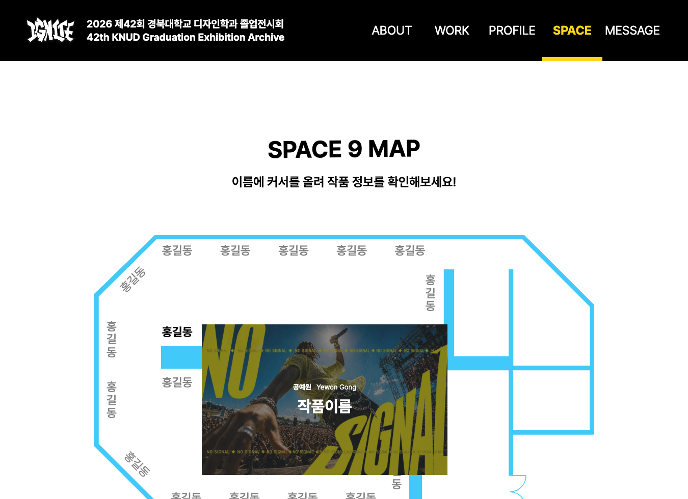
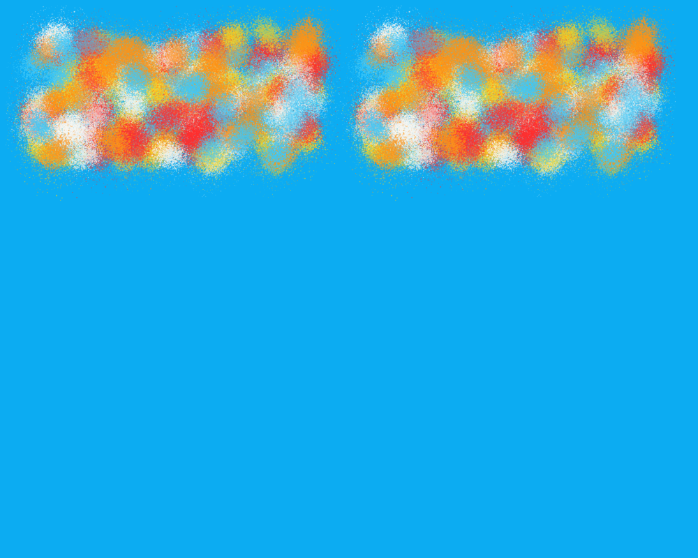

# KNUD 2026

**2026 경북대학교 디자인학과 졸업전시 웹사이트**

작품과 작가, 전시 공간을 탐색하고 전시의 시각적 콘셉트를 인터랙션으로 경험하는 온라인 아카이브입니다.

[실제 서비스](https://www.2026-knud-graduation.com/) · [디자인·QA 기록](docs/design/README.md) · [아키텍처 결정](docs/architecture/adr/) · [구현 PR](https://github.com/KNU-Design-Web-2026/knud2026/pulls?q=is%3Apr+is%3Amerged)

<p align="center">
  


</p>

> 이미지들은 저장소에 남긴 실제 구현·QA 기록입니다. 촬영 이후 변경된 디자인은 현재 서비스와 다를 수 있습니다.

## 목차

- [프로젝트 소개](#프로젝트-소개)
- [주요 화면](#주요-화면)
- [기술 스택과 구조](#기술-스택과-구조)
- [주요 기술적 고민](#주요-기술적-고민)
- [디자인 협업과 검증](#디자인-협업과-검증)
- [로컬 실행](#로컬-실행)
- [문서와 참여](#문서와-참여)

## 프로젝트 소개

관람객은 전시 소개를 읽고 작품·작가별 페이지와 전시 지도를 오가며 전시를 둘러봅니다. 메인 화면에서는 포인터를 따라 스프레이를 칠하고 사자와 도화선의 애니메이션을 볼 수 있습니다.

전시 콘텐츠를 전달하는 페이지와 표현 중심의 인터랙션을 하나의 Next.js 애플리케이션에서 관리합니다. 작품·작가 정보는 저장소의 데이터 파일을 통해 갱신하며, 디자인 QA와 구현 판단은 문서·PR로 남깁니다.

## 주요 화면

| 화면 | 방문자가 할 수 있는 일 | 경로 |
| --- | --- | --- |
| Main | 스프레이와 도화선·캐릭터 인터랙션 경험 | `/` |
| About | 전시 소개와 참여 정보 확인 | `/about` |
| Work | 작품 목록 탐색과 개별 작품 상세 확인 | `/work`, `/work/[id]` |
| Profile | 작가 목록과 개별 작가 정보 확인 | `/profile`, `/profile/[id]` |
| Space | 전시 지도와 작품 배치 확인 | `/space` |
| Message | 저장된 응원 메시지 조회·작성 | `/message`, `/api/letters` |

### 메인 인터랙션

포인터 입력으로 남긴 자국에 질감·농도·시간에 따른 페이드와 드립을 적용합니다. 사자의 도화선과 폭발 모션은 별도의 애니메이션으로 구성합니다.

- [스프레이 표현 명세](docs/design/interaction-specs/2026-09-11-spray-paint.md)
- [도화선 인터랙션 명세](docs/design/interaction-specs/2026-09-10-hero-fuse.md)

### 전시 공간 탐색

<p align="center">
  
</p>

화면 크기에 따라 전시 지도와 작품 정보를 배치합니다. 위 이미지는 전시 공간 페이지 구현 당시의 기록입니다.

[Space 구현 PR #12](https://github.com/KNU-Design-Web-2026/knud2026/pull/12) · [반응형 화면 명세](docs/design/2026-09-04-space-page.md)

### 현재 구현 범위

Message의 새 글은 현재 클라이언트 상태에 추가됩니다. **서버·DB에 영구 저장하는 방명록은 아직 구현되어 있지 않으며 새로고침 후 작성 상태가 유지되지 않습니다.** 초기 ADR의 DB·관리자 구성은 설계 방향으로 읽어주세요.

QA Hub는 별도 도구입니다. 이 저장소는 허용된 Hub에 현재 페이지 경로를 전달하는 브리지를 포함하며, Hub 전체 기능을 구현하는 저장소는 아닙니다.

## 기술 스택과 구조

| 구분 | 기술 | 사용 범위 |
| --- | --- | --- |
| 애플리케이션 | Next.js 16, React 19 | App Router 기반 페이지와 인터랙션 |
| 언어 | TypeScript | 컴포넌트·데이터·입력 및 렌더링 로직 |
| 스타일 | Tailwind CSS 4, CSS Modules, CSS | 공통 토큰, 반응형 레이아웃, 모션 |
| 스프레이 | Canvas 2D, ImageBitmap, requestAnimationFrame | 질감 생성·합성·렌더링 시점 관리 |
| 품질 확인 | ESLint, TypeScript, Node.js test runner | 정적 검사와 단위·구조 테스트 |
| 패키지 관리 | pnpm | `package.json`의 버전과 lockfile 기준 설치 |

```text
src/
├── app/                  페이지, 메타데이터, 공통 레이아웃
├── components/
│   ├── main/             메인 모션과 스프레이 렌더링
│   ├── layout/           헤더·푸터·커서·QA 경로 브리지
│   └── about|work|profile|space|message/  화면별 UI
├── data/                 작품·작가 정적 데이터와 화면용 fixture
├── features/             롤링페이퍼 검증·서비스·DB 접근
├── lib/                  입력 검증과 QA 메시지 계약
└── styles/               공통 스타일과 토큰
docs/                     설계 결정, 인터랙션 명세, QA 기록
scripts/                  실제 브라우저 QA와 자산 생성 스크립트
public/                   전시 이미지와 디자인 자산
```

정적인 콘텐츠와 브라우저 입력 처리를 구분합니다. 스프레이 역시 입력·수명 계산, 질감, 그룹 캐시, 합성, 렌더 스케줄을 나누어 관리합니다. 상세 선택 배경은 [Next.js 선정 ADR](docs/architecture/adr/0001-use-nextjs.md)에 기록했습니다.

## 주요 기술적 고민

### 1. 디자인 피드백을 스프레이 동작 규칙으로 옮기기

단순한 원형 브러시만으로는 전시에서 의도한 스프레이의 불규칙한 질감을 표현하기 어려웠습니다. 입력과 자국의 생성 상태를 구분하고, 질감과 시간에 따른 표현을 별도로 다루었습니다. 도화선 모션도 꼬리의 곡선과 끝 지점을 기준으로 QA했습니다.

[구현 PR #16](https://github.com/KNU-Design-Web-2026/knud2026/pull/16) · [디자이너 QA 기록](docs/design/qa/2026-09-10-designer-qa.md)

### 2. 표현을 유지하면서 반복 합성 줄이기

빠른 입력에서는 화면에 남아 있는 자국을 반복해서 합성하는 작업이 늘어납니다. 자국을 줄이는 방법만 택하지 않고, 재사용 가능한 질감과 변하지 않는 자국 묶음을 캐시하고 실제 변화가 필요한 시점에 렌더링하도록 작업을 나눴습니다.

| 단계 | 구현 판단 | 기록 |
| --- | --- | --- |
| 질감 재사용 | ImageBitmap 사용 경로와 대체 경로 마련 | [PR #17](https://github.com/KNU-Design-Web-2026/knud2026/pull/17) |
| 안정 그룹 캐시 | 정적인 자국 묶음과 변화 중인 표현을 분리 | [PR #18](https://github.com/KNU-Design-Web-2026/knud2026/pull/18) |
| 렌더 스케줄 | 정적 구간의 연속 렌더링을 멈추고 다음 변화 예약 | [PR #19](https://github.com/KNU-Design-Web-2026/knud2026/pull/19) |

<p align="center">
  
</p>

위 비교는 **표현 보존을 확인하는 시각 QA**입니다. CPU·GPU 사용률이나 FPS 개선 그래프가 아닙니다. [픽셀 비교 결과](docs/design/qa/stamp-cache-pixel-results.json)와 PR의 검증 조건을 함께 확인할 수 있습니다. 초기 후보 문서와 후속 구현은 구분하며, 후보가 곧 성능 개선을 의미하지는 않습니다.

### 3. 다른 도메인의 QA 도구에 현재 경로 전달하기

QA Hub의 iframe에서 작품·작가 페이지로 이동하면, Hub가 실제 페이지 경로를 알 수 있어야 의견을 올바른 화면에 연결할 수 있습니다. 브리지는 부모 window와 허용 origin을 확인한 뒤 공개 페이지의 `pathname`만 전달합니다. 일반 탭이거나 설정이 없는 경우에는 동작하지 않습니다.

[경로 전달 ADR](docs/architecture/adr/0004-report-qa-route-to-hub.md) · [브리지 구현](src/components/layout/qa-route-bridge.tsx) · [메시지 계약과 검증](src/lib/qa-route-bridge.ts)

## 디자인 협업과 검증

디자인에서 정한 표현을 구현 가능한 입력·상태·반응형 규칙으로 구체화하고, 검수 중 발견한 차이는 날짜별 QA 문서로 남깁니다.

- **요구사항:** [공통 컴포넌트 기준](docs/design/common-components.md), [인터랙션 명세](docs/design/interaction-specs/)
- **변경 기록:** [디자인 QA](docs/design/qa/), [병합된 PR](https://github.com/KNU-Design-Web-2026/knud2026/pulls?q=is%3Apr+is%3Amerged)
- **코드 검증:** 입력·질감·캐시·스케줄·경로 브리지의 `*.test.mjs`
- **브라우저 검증:** `scripts/qa-*.mjs`의 실제 화면·수명주기 확인

브라우저 QA 스크립트는 Playwright가 별도로 필요합니다. 현재 `package.json`에는 Playwright와 Storybook·Chromatic이 설치되어 있지 않으므로, 관련 설계 문서를 곧 실행 가능한 검증 환경으로 보아서는 안 됩니다. 기능 테스트 통과와 프로덕션 성능 측정 결과도 구분합니다.

## 로컬 실행

### 준비

Node.js와 pnpm이 필요합니다. pnpm은 `package.json`의 `packageManager`에 지정된 **11.15.1**을 사용하세요. TypeScript를 직접 읽는 테스트는 이를 지원하는 최신 Node.js LTS 환경에서 실행합니다.

```bash
git clone https://github.com/KNU-Design-Web-2026/knud2026.git
cd knud2026
pnpm install --frozen-lockfile
pnpm dev
```

개발 서버: <http://localhost:3000>

일반 전시 화면 실행에는 QA Hub 환경 변수가 필요하지 않습니다. Hub의 iframe에서 경로 연동을 확인할 때만 `.env.example`을 참고해 `.env.local`에 다음 값을 설정하세요.

```dotenv
NEXT_PUBLIC_QA_HUB_ORIGIN=https://your-qa-hub.example.com
```

값은 허용할 Hub의 정확한 origin입니다. `NEXT_PUBLIC_` 값은 브라우저에 노출되므로 비밀값을 넣지 않습니다.

### MESSAGE 저장소 연결

`/message`는 브라우저의 임시 상태가 아니라 Supabase PostgreSQL의 공개 편지를 조회합니다. 먼저 Supabase SQL Editor에서 [`20260915000100_create_public_letters.sql`](supabase/migrations/20260915000100_create_public_letters.sql)을 적용한 뒤 다음 서버 전용 값을 `.env.local`과 배포 환경에 설정하세요.

```dotenv
KNUD_MESSAGES_SUPABASE_URL=https://your-project.supabase.co
KNUD_MESSAGES_SUPABASE_SERVICE_ROLE_KEY=server-only-service-role-key
KNUD_MESSAGES_RATE_LIMIT_SECRET=long-random-server-secret
```

Service Role Key와 요청 제한용 비밀값에는 `NEXT_PUBLIC_` 접두사를 붙이지 않습니다. 브라우저는 Supabase를 직접 호출하지 않고 `/api/letters`만 사용합니다. 작성 데이터는 서버에서 다시 검증하며 같은 요청 식별자의 성공 전송은 10분 동안 5건으로 제한합니다.

DB가 연결되지 않았거나 저장에 실패하면 작성 성공처럼 카드를 추가하지 않습니다. 저장 성공 응답을 받은 메시지만 목록 맨 앞에 즉시 표시됩니다. 저장 구조와 보안 경계는 [ADR-0005](docs/architecture/adr/0005-use-supabase-for-public-letters.md)에 기록했습니다.

### 검사와 프로덕션 빌드

```bash
pnpm lint
pnpm type-check
pnpm build
pnpm start
```

스프레이 렌더 스케줄 단위 테스트 예시:

```bash
node --test src/components/main/spray-render-schedule.test.mjs
```

롤링페이퍼 API 계약과 입력 검증은 다음 명령으로 확인합니다.

```bash
pnpm test:rolling-paper
```

그 밖의 `*.test.mjs`와 브라우저 QA 스크립트는 각 실행 환경과 별도 의존성을 확인한 뒤 실행하세요.

## 문서와 참여

- 개발: [이준섭 · SubJeeLee](https://github.com/SubJeeLee)
- 디자인: 전시 디자인 팀과 협업하며, 화면별 요구사항과 검수 내용은 [디자인 문서](docs/design/README.md)에 기록합니다.
- 개발 규칙: [컨벤션](docs/conventions/README.md), [리뷰 기준](docs/conventions/review.md)

이 README는 현재 저장소의 구현을 기준으로 안내합니다. 초기 설계·최적화 후보·실제 반영 결과가 다를 수 있으므로, 기술적 판단은 해당 문서와 PR을 함께 확인해주세요.
